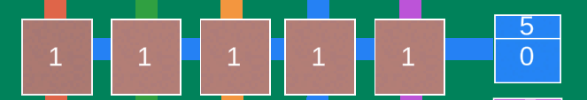

Voltorb Flip mini-game from Pokémon SS/HG recreated in unity.
------------------------------------------------------------
GAME IS NOT SCALING RIGHT SO DON'T PLAY IT!

Game: https://zzokku.github.io/vflip/glbuild/index.html 

Caution: The game doesn't scale right on full screen.

Info/Rules
---
Basic information about the original mini-game:
https://bulbapedia.bulbagarden.net/wiki/Voltorb_Flip

The game has four types of multipliers:
0x,
1x,
2x,
3x.

Objective is to multiply your coins with every over 0x multiplier each level. If you flip card and it holds 0x multiplier the game ends. 

Sum of over 0x multipliers and total amount of 0x multipliers are displayed in each row and column.  
Like this:

The game ends when you hit max level (8). Before that the amount of different multipliers always increases every level.

Code
----
[C# Scripts](Assets/Scripts)

